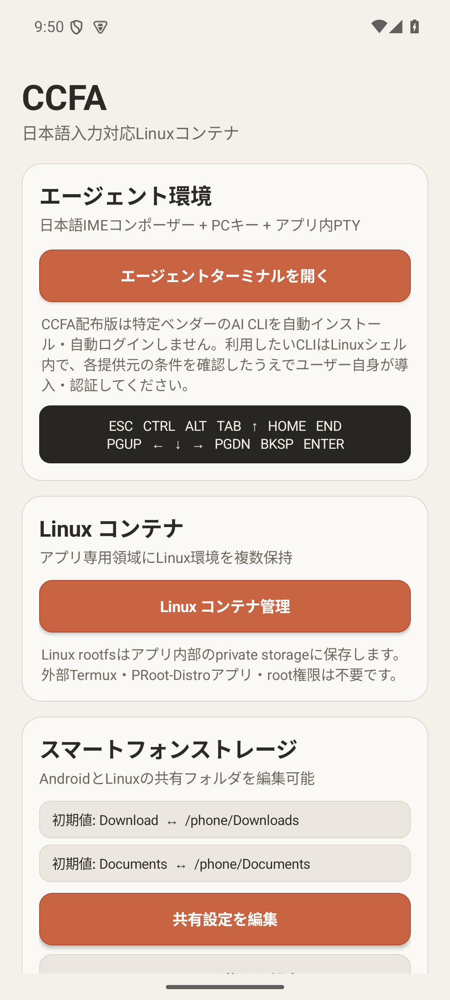
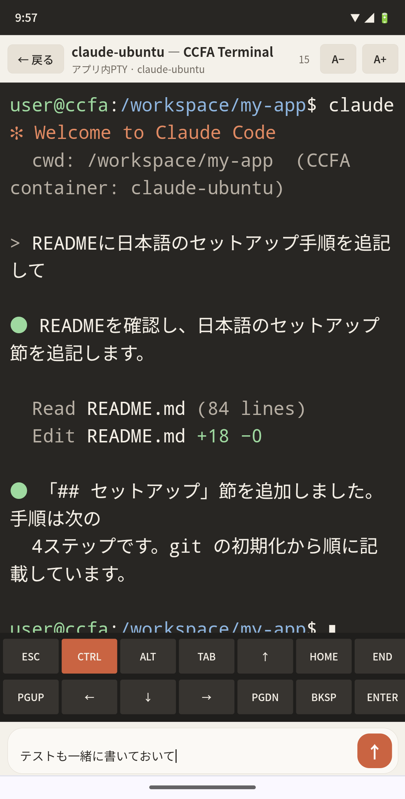
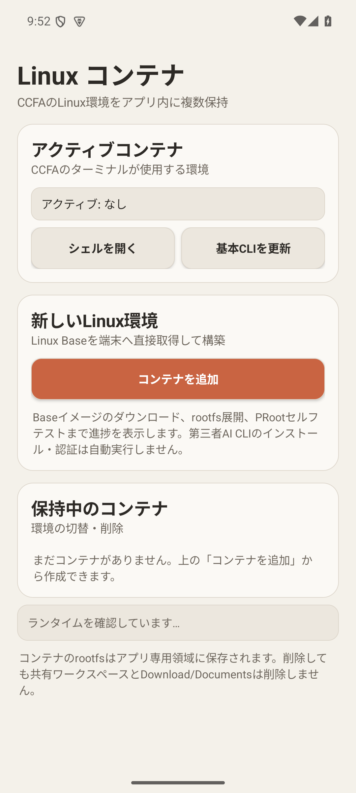
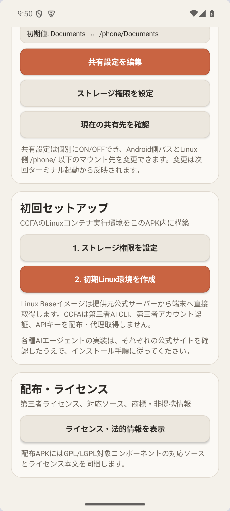
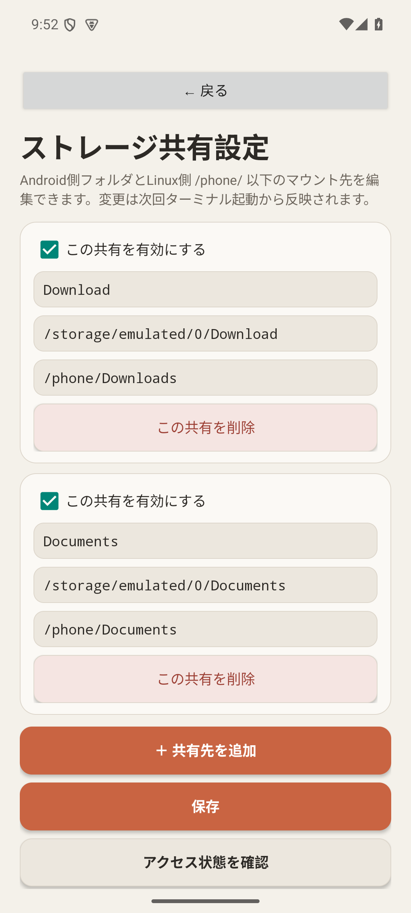
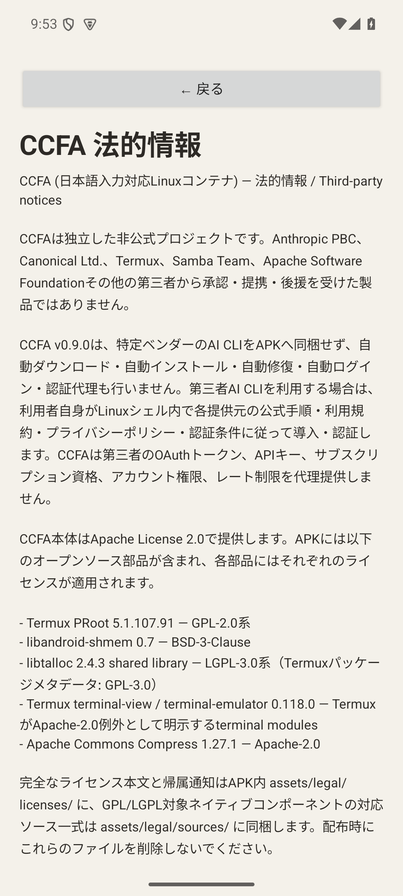

<div align="center">

# CCFA — 日本語入力対応Linuxコンテナ

**Androidだけで、AIエージェントが動くLinux環境を。**

外部のTermuxアプリやroot権限を必要とせず、アプリ内にLinux実行環境とPTYターミナルを構築するオープンソースアプリです。<br>
Androidの日本語IMEでかな漢字変換した文字列を、そのままLinuxターミナルへ送信できます。

[](https://github.com/hatake716/CCFA/actions/workflows/android-ci.yml)
&nbsp;
&nbsp;-3DDC84)
&nbsp;
&nbsp;

<br>


&nbsp;

&nbsp;


<br><br>

**[⬇ 最新版をダウンロード](https://github.com/hatake716/CCFA/releases/latest)** &nbsp;·&nbsp; [🐧 紹介ページ](https://hatake716.github.io/CCFA/)

</div>

---

## 目次

- [CCFAとは](#ccfaとは)
- [できること](#できること)
- [画面紹介](#画面紹介)
- [必要環境](#必要環境)
- [インストール](#インストール)
- [使い方](#使い方)
- [応用編 — AIエージェントを導入する](#応用編--aiエージェントを導入する)
- [アーキテクチャ](#アーキテクチャ)
- [ソースからビルド](#ソースからビルド)
- [ライセンスと第三者コンポーネント](#ライセンスと第三者コンポーネント)
- [非提携について](#非提携について)

---

## CCFAとは

CCFA は、Android 1台で完結する Linux コンテナ環境です。

一般的な「Android で Linux を動かす」構成では、Termux などの別アプリや複雑な初期設定が必要でした。CCFA はそれらを **1つのアプリの中に内蔵** し、次を提供します。

- アプリ内に展開する Linux rootfs コンテナ
- root 不要・外部アプリ不要で動く PRoot ランタイム
- 日本語 IME でそのまま入力できるアプリ内 PTY ターミナル
- Android ↔ Linux のファイル共有

これにより、Linux 上で動く **CLI 型の AI エージェント** を、スマートフォンだけで日本語のまま操作できる土台になります。

> [!NOTE]
> CCFA は特定の AI サービス専用クライアントではありません。AI エージェントは同梱せず、ユーザーが各提供元の公式手順に従って Linux 環境内に導入します。詳しくは [応用編](#応用編--aiエージェントを導入する) を参照してください。

- Version: **v1.0.0**
- 対応CPU: **ARM64 / arm64-v8a**
- Android: **8.0 (API 26) 以降**
- License: **Apache License 2.0**（同梱する第三者コンポーネントには各ライセンスが適用されます）

---

## できること

### 🐧 AndroidだけでLinux環境を構築

アプリ内に以下を組み込みます。

- Android/Bionic 向け PRoot ランタイム
- アプリ内 PTY ターミナル
- Linux rootfs コンテナ
- `/workspace` 作業領域
- 複数 Linux コンテナの作成・切替・削除

初回セットアップ時に Linux Base を公式配布元から端末へ取得し、アプリ専用領域へ展開します。Linux Base 自体は APK には同梱していません。

### 🇯🇵 日本語IME対応ターミナル

ターミナル最下部に Android 標準の入力欄を用意しています。Gboard などで通常どおりかな漢字変換した後、その文字列を UTF-8 で PTY へ送信できます。

次の PC 向け補助キーを画面上から利用できます。

```text
ESC  CTRL  ALT  TAB  ↑  HOME  END
PGUP ←    ↓    →    PGDN BKSP ENTER
```

ターミナル文字サイズは `A− / A+` またはピンチ操作で変更でき、設定は保存されます。

### 📁 スマートフォンストレージとの共有

Android 側フォルダを Linux コンテナ内へマウントできます。初期設定は次のとおりです。

```text
Android Download   → /phone/Downloads
Android Documents  → /phone/Documents
```

アプリの **「スマートフォンストレージ」→「共有設定を編集」** から、以下を変更できます。

- 共有ごとの ON / OFF
- Android 側フォルダのパス
- Linux 側 `/phone/` 以下のマウント先
- 表示名 / 共有設定の追加・削除
- 読み書き確認 / 初期設定への復元

最大8件まで登録できます。変更内容は次回ターミナル起動時から反映されます。

> 共有ストレージは Android とのファイル交換用途に適しています。実行ファイルや Linux 開発環境本体は `/workspace` の利用を推奨します。

### 📦 複数Linuxコンテナ

Linux 環境を複数作成して使い分けられます。開発用・検証用・AI ツール用など、用途ごとに rootfs を分離できます。コンテナを削除しても、共有 `/workspace` や Android 側の共有フォルダは削除されません。

---

## 画面紹介

| ホーム | 初回セットアップ | Linuxコンテナ管理 |
|:---:|:---:|:---:|
|  |  |  |
| エージェント環境・コンテナ・ストレージへの入口 | ストレージ権限と初期Linux環境の作成 | コンテナの作成・切替・削除 |

| ストレージ共有設定 | 法的情報 | ターミナル（AIエージェント操作例） |
|:---:|:---:|:---:|
|  |  |  |
| Android↔Linuxの共有フォルダを編集 | ライセンス・対応ソース・非提携情報 | 日本語入力欄とPC補助キーでLinux CLIを操作 |

> ターミナル画面は、Linux 環境内に導入した AI エージェント（例では `claude`）を、画面最下部の日本語入力欄から操作している様子です。CCFA 自体は AI エージェントを同梱しません。

---

## 必要環境

- **Android 8.0 (API 26) 以降**
- **ARM64 / arm64-v8a 端末**（アプリ内 PRoot ランタイムが arm64 向け）
- インターネット接続（初回の Linux Base 取得時）
- Linux 環境を保存できる空き容量

---

## インストール

### 1. APKをダウンロード

GitHub の **[Releases](https://github.com/hatake716/CCFA/releases)** から最新の CCFA APK をダウンロードします。

- 最新版: **v1.0.0** — [`CCFA-v1.0.0-debug.apk`](https://github.com/hatake716/CCFA/releases/latest)

> [!TIP]
> ダウンロード後、Release ページに併記された `.sha256` の値と、端末上のファイルの SHA-256 を照合すると、ファイルの完全性を確認できます。

### 2. APKのインストールを許可

ブラウザやファイルマネージャーから APK を開きます。必要な場合は Android 設定で「この提供元のアプリを許可」を有効にしてインストールします。

> [!NOTE]
> 配布バイナリは開発時の **debug 署名のサイドロードビルド** です。将来のリリースが専用の署名鍵へ切り替わる場合、Android の仕様上、一度アンインストールしてから新しいリリースを導入する必要が生じることがあります。

### 3. CCFAを起動

アプリを起動したら、必要に応じてストレージ権限を設定します。

---

## 使い方

### ステップ1 — 初期Linux環境を作成

ホーム画面の **「初回セットアップ」** から進めます。

1. **「1. ストレージ権限を設定」** を押し、必要に応じて権限を許可します。
2. **「2. 初期Linux環境を作成」** を押します。

セットアップは次の順に進みます。

```text
PRootランタイム確認
      ↓
Linux Baseダウンロード
      ↓
rootfs展開
      ↓
PRoot起動テスト
      ↓
基本CLIセットアップ
```

初回のみ、Linux Base のダウンロードと展開に時間がかかります。

<div align="center">

</div>

### ステップ2 — ターミナルを開く

セットアップ完了後、ホームの **「エージェントターミナルを開く」** から Linux シェルを利用できます。

- 画面最下部の **日本語入力欄** に、かな漢字変換した文字列やコマンドを入力し、送信ボタン（↑）または Enter で送信します。
- **PC 補助キー**（ESC / CTRL / TAB / 矢印 など）を画面上からタップできます。
- **`A− / A+`** またはピンチで文字サイズを調整できます。

### ステップ3 — プロジェクトを置く

Linux 側の **`/workspace`** は、コンテナを削除しても残る共有作業領域です。ここに Git リポジトリやプロジェクトを置いて作業します。

Android 側のファイルとやり取りしたい場合は、**「スマートフォンストレージ」→「共有設定を編集」** で設定した `/phone/` 以下を利用します。

### コンテナを使い分ける

**「Linux コンテナ管理」** から、用途別にコンテナを追加・切替・削除できます。アクティブなコンテナが、ターミナルが使用する環境になります。

---

## 応用編 — AIエージェントを導入する

CCFA は、Linux 上で動作する **CLI 型 AI エージェント** を利用するための土台として使えます。

> [!IMPORTANT]
> CCFA は第三者の AI エージェントを APK へ同梱せず、自動インストール・自動ログイン・認証情報の代理取得も行いません。
> AI エージェントの利用条件・認証は、すべて **各提供元との直接の関係** になります。

### 導入の流れ

1. CCFA で Linux 環境を作成する（[使い方](#使い方) 参照）
2. **「エージェントターミナルを開く」** から Linux シェルを開く
3. 利用したい AI エージェントの **公式サイト・公式ドキュメントを確認する**
4. その提供元が案内している **Linux 向けインストール手順** に従う
5. 認証・ログインも提供元の公式手順に従う
6. `/workspace` でプロジェクトを開き、AI エージェントを起動する
7. 日本語入力は画面最下部の CCFA 入力欄から行う

### イメージ

<div align="center">

</div>

上の例では、Linux 環境内に導入した CLI エージェントを起動し、**日本語のまま指示** を送っています。エージェントが `/workspace` 内のファイルを読み書きし、結果をターミナルに返します。

### なぜCCFAが向いているのか

- **日本語で指示できる** — Gboard などでかな漢字変換した文章を、そのまま CLI エージェントへ送れます。ターミナル直接入力では難しい日本語入力を、専用の入力欄が仲介します。
- **PC 補助キーがある** — `CTRL+C` などエージェントの対話に必要なキーを画面から送れます。
- **プロジェクトが残る** — `/workspace` はコンテナを削除しても残るため、作業を継続できます。
- **環境を分けられる** — エージェントごと・案件ごとにコンテナを分離できます。

> [!WARNING]
> 各 AI エージェントは更新頻度が高く、インストール方法や認証方法が変更される可能性があります。そのため本 README には固定のインストールコマンドを転載していません。**常に各提供元の最新の公式手順を確認してください。**

### Gitについて

CCFA には Android 側の専用 Git GUI はありません。Linux 環境内に一般的な開発ツールとして `git` を導入し、必要な Git 操作は Linux シェル、または導入した開発ツール・AI エージェントから行います。

---

## アーキテクチャ

```text
Android / CCFA APK
        │
        ├─ Android UI + 日本語IME入力欄
        ├─ TerminalView / TerminalSession
        ├─ /dev/ptmx
        │
        ▼
Android/Bionic PRoot
        │
        ▼
Linux rootfs
        ├─ /workspace          ← コンテナ間で共有・永続
        └─ /phone/*            ← ユーザー設定可能な共有フォルダ
```

詳しくは [`docs/ARCHITECTURE.md`](docs/ARCHITECTURE.md) を参照してください。

---

## ソースからビルド

主な必要環境:

- JDK 17
- Gradle 9.5.0
- Android SDK 36
- Android Gradle Plugin 9.3.0

配布用ビルドでは、まず Android/Bionic PRoot とライセンス資料を準備します。

```bash
bash scripts/prepare-termux-android-proot.sh
bash scripts/prepare-distribution-legal.sh
gradle :app:assembleDebug
```

現在の実装は app-private 領域の Linux userland を PRoot で実行するため、`compileSdk 36 / targetSdk 28 / minSdk 26` を使用しています。

リリースは、`v*` タグを push すると [`Publish Release`](.github/workflows/publish-release.yml) ワークフローが、公開ソースから配布用 APK を再現ビルドし、SHA-256 を計算して GitHub Release を作成します。

---

## ライセンスと第三者コンポーネント

CCFA 本体は **Apache License 2.0** で公開しています。

主な第三者コンポーネント:

- PRoot
- libandroid-shmem
- libtalloc
- Termux terminal-view / terminal-emulator
- Apache Commons Compress / Codec / IO / Lang

配布 APK には、必要なライセンス本文・NOTICE・GPL/LGPL 対象コンポーネントの対応ソースを `assets/legal/` に同梱します。

詳細:

- [`LICENSE`](LICENSE)
- [`THIRD_PARTY_NOTICES.md`](THIRD_PARTY_NOTICES.md)
- [`TRADEMARKS.md`](TRADEMARKS.md)
- [`PRIVACY.md`](PRIVACY.md)
- [`docs/DISTRIBUTION.md`](docs/DISTRIBUTION.md)
- [`docs/PROOT-SOURCE-OFFER.md`](docs/PROOT-SOURCE-OFFER.md)

---

## 非提携について

CCFA は独立したオープンソースプロジェクトです。Anthropic、Canonical、Termux、Apache Software Foundation、Samba Team その他の第三者の公式製品ではなく、承認・提携・後援を受けた製品でもありません。第三者の名称・商標は各権利者に帰属します。
